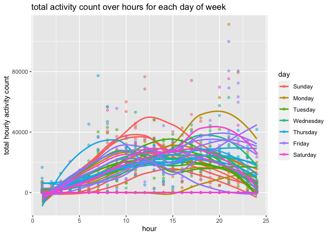

p8105_hw3_zw2899
================
Ziqing Wang
2022-10-10

# problem 1

First, immport the instacart dataset accoriding to the instructions:

``` r
library(p8105.datasets)
data("instacart")
```

The dataset has 1384617 observations and 15 variables. Each observation
contains information on one product ordered by the user.

There are 134 distinct aisles.

Below is a bar plot that shows the number of items ordered in aisles
with more than 10000 items ordered, arranged by descending items
ordered.

``` r
instacart %>%
  group_by(aisle) %>%
  summarize(n_ordered_by_aisle = n()) %>%
  filter(n_ordered_by_aisle >= 10000) %>%
  arrange(desc(n_ordered_by_aisle)) %>%
  mutate(order_magnitude = case_when(
    n_ordered_by_aisle <= 15000 ~ "<=15K",
    n_ordered_by_aisle <= 20000 & n_ordered_by_aisle > 15000 ~ "15K-20K",
    n_ordered_by_aisle <= 30000 & n_ordered_by_aisle > 20000 ~ "20K-30K",
    n_ordered_by_aisle <= 50000 & n_ordered_by_aisle > 30000 ~ "30K-50K",
    TRUE ~ ">50K"
    )) %>%
  mutate(order_magnitude = factor(order_magnitude, levels = c(">50K", "30K-50K", "20K-30K", "15K-20K", "<=15K"))) %>%
  ggplot(aes(x = aisle, y = n_ordered_by_aisle)) + 
  geom_col() + 
  facet_wrap(vars(order_magnitude), scales = "free", ncol = 1) + 
  labs(title = "number of orders on popular aisles", y = "number of orders") +
  theme_bw(base_size=50) +
  theme(panel.spacing.y = unit(10, "line"),
        axis.text.x = element_text(angle = 30, hjust=1))
```

<!-- -->

Below is a table showing the three most popular items in each of the
aisles “baking ingredients”, “dog food care”, and “packaged vegetables
fruits”, along with the number of times each item is ordered.

``` r
instacart %>%
  filter(aisle %in% c("baking ingredients", "dog food care", "packaged vegetables fruits")) %>%
  group_by(aisle, product_name) %>%
  summarize(n_ordered = n()) %>%
  arrange(aisle, desc(n_ordered)) %>%
  group_by(aisle) %>%
  slice(1:3) %>%
  rename(most_ordered_product = product_name) 
```

    ## `summarise()` has grouped output by 'aisle'. You can override using the
    ## `.groups` argument.

    ## # A tibble: 9 × 3
    ## # Groups:   aisle [3]
    ##   aisle                      most_ordered_product                        n_ord…¹
    ##   <chr>                      <chr>                                         <int>
    ## 1 baking ingredients         Light Brown Sugar                               499
    ## 2 baking ingredients         Pure Baking Soda                                387
    ## 3 baking ingredients         Cane Sugar                                      336
    ## 4 dog food care              Snack Sticks Chicken & Rice Recipe Dog Tre…      30
    ## 5 dog food care              Organix Chicken & Brown Rice Recipe              28
    ## 6 dog food care              Small Dog Biscuits                               26
    ## 7 packaged vegetables fruits Organic Baby Spinach                           9784
    ## 8 packaged vegetables fruits Organic Raspberries                            5546
    ## 9 packaged vegetables fruits Organic Blueberries                            4966
    ## # … with abbreviated variable name ¹​n_ordered

Below is a table showing the mean hour of the day at which Pink Lady
Apples and Coffee Ice Cream are ordered on each day of the week in a
readable format.

``` r
instacart %>%
  filter(product_name %in% c("Pink Lady Apples", "Coffee Ice Cream")) %>%
  mutate(new_dow = order_dow + 1) %>%
  mutate(day_of_week = wday(new_dow, label = T)) %>%
  group_by(product_name, day_of_week) %>%
  summarize(mean_hour_ordered = mean(order_hour_of_day)) %>%
  pivot_wider(names_from = day_of_week, values_from = mean_hour_ordered)
```

    ## `summarise()` has grouped output by 'product_name'. You can override using the
    ## `.groups` argument.

    ## # A tibble: 2 × 8
    ## # Groups:   product_name [2]
    ##   product_name       Sun   Mon   Tue   Wed   Thu   Fri   Sat
    ##   <chr>            <dbl> <dbl> <dbl> <dbl> <dbl> <dbl> <dbl>
    ## 1 Coffee Ice Cream  13.8  14.3  15.4  15.3  15.2  12.3  13.8
    ## 2 Pink Lady Apples  13.4  11.4  11.7  14.2  11.6  12.8  11.9

# problem 2

First, import and tidy the accelerometer data:

``` r
accel_data = read_csv("./data/accel_data.csv") %>%
  janitor::clean_names() %>%
  pivot_longer(cols = "activity_1":"activity_1440", 
               names_to = "minute", 
               values_to = "activity_count") %>%
  mutate(if_weekend = case_when(day %in% c("Friday", "Thursday", "Wednesday", "Tuesday", "Monday") ~ "weekday",
                                TRUE ~ "weekend")) %>%
  separate(minute, c("m1", "minute"), sep = "_") %>%
  select(-m1) %>%
  mutate(minute = as.numeric(minute),
         hour = rep(rep(seq(1,24), each=60), 35)) %>%
  mutate(day = factor(day, levels = c("Sunday", "Monday", "Tuesday", "Wednesday", "Thursday", "Friday", "Saturday")),
         day = factor(day))
```

    ## Rows: 35 Columns: 1443
    ## ── Column specification ────────────────────────────────────────────────────────
    ## Delimiter: ","
    ## chr    (1): day
    ## dbl (1442): week, day_id, activity.1, activity.2, activity.3, activity.4, ac...
    ## 
    ## ℹ Use `spec()` to retrieve the full column specification for this data.
    ## ℹ Specify the column types or set `show_col_types = FALSE` to quiet this message.

``` r
accel_data
```

    ## # A tibble: 50,400 × 7
    ##     week day_id day    minute activity_count if_weekend  hour
    ##    <dbl>  <dbl> <fct>   <dbl>          <dbl> <chr>      <int>
    ##  1     1      1 Friday      1           88.4 weekday        1
    ##  2     1      1 Friday      2           82.2 weekday        1
    ##  3     1      1 Friday      3           64.4 weekday        1
    ##  4     1      1 Friday      4           70.0 weekday        1
    ##  5     1      1 Friday      5           75.0 weekday        1
    ##  6     1      1 Friday      6           66.3 weekday        1
    ##  7     1      1 Friday      7           53.8 weekday        1
    ##  8     1      1 Friday      8           47.8 weekday        1
    ##  9     1      1 Friday      9           55.5 weekday        1
    ## 10     1      1 Friday     10           43.0 weekday        1
    ## # … with 50,390 more rows

Next, aggregate across minutes to create a total activity variable for
each day:

``` r
total_activity_summary = accel_data %>%
  group_by(week, day) %>%
  summarize(total_activity = sum(activity_count)) 
```

    ## `summarise()` has grouped output by 'week'. You can override using the
    ## `.groups` argument.

``` r
total_activity_summary
```

    ## # A tibble: 35 × 3
    ## # Groups:   week [5]
    ##     week day       total_activity
    ##    <dbl> <fct>              <dbl>
    ##  1     1 Sunday           631105 
    ##  2     1 Monday            78828.
    ##  3     1 Tuesday          307094.
    ##  4     1 Wednesday        340115.
    ##  5     1 Thursday         355924.
    ##  6     1 Friday           480543.
    ##  7     1 Saturday         376254 
    ##  8     2 Sunday           422018 
    ##  9     2 Monday           295431 
    ## 10     2 Tuesday          423245 
    ## # … with 25 more rows

There is no apparent trend of activity count by day.

``` r
hourly_accel_data = accel_data %>%
  #filter(day %in% c("Saturday", "Friday") & week %in% c(1,2,3)) %>%
  group_by(week, day, hour) %>%
  summarize(total_activity_min = sum(activity_count)) 
```

    ## `summarise()` has grouped output by 'week', 'day'. You can override using the
    ## `.groups` argument.

``` r
hourly_accel_data
```

    ## # A tibble: 840 × 4
    ## # Groups:   week, day [35]
    ##     week day     hour total_activity_min
    ##    <dbl> <fct>  <int>              <dbl>
    ##  1     1 Sunday     1               1084
    ##  2     1 Sunday     2                614
    ##  3     1 Sunday     3               7766
    ##  4     1 Sunday     4              20625
    ##  5     1 Sunday     5              11380
    ##  6     1 Sunday     6               1057
    ##  7     1 Sunday     7                290
    ##  8     1 Sunday     8              16756
    ##  9     1 Sunday     9              37128
    ## 10     1 Sunday    10              60013
    ## # … with 830 more rows

``` r
hourly_accel_data %>% ggplot(aes(x = hour, y = total_activity_min, 
                                 group = interaction(week, day), color = day)) + 
  geom_point(alpha = 0.5) +
  geom_smooth(se = F)
```

    ## `geom_smooth()` using method = 'loess' and formula 'y ~ x'

<!-- -->

``` r
  #geom_line() 
```

# problem 3

First, load the NY NOAA data

``` r
data("ny_noaa")
```

The imported NOAA dataset has 2595176 observations and 7 columns. The
dataset contains information reported from weather stations in the state
of New York on dates from January 1, 1981 through December 31, 2010 -
including the precipitation (tenth of mm), snowfall (mm), snow depth
(mm), maximum daily temperature, and minimum daily temperature (both in
tenth of Celsius). Note that there are many missing data in this
dataset:

``` r
total_obs_noaa = nrow(ny_noaa)
ny_noaa %>%
  summarise_all(funs(sum(is.na(.)))) %>%
  pivot_longer(id:tmin, names_to = "variable", values_to = "percent_missing") %>%
  mutate(percent_missing = percent_missing/total_obs_noaa*100)
```

    ## Warning: `funs()` was deprecated in dplyr 0.8.0.
    ## Please use a list of either functions or lambdas: 
    ## 
    ##   # Simple named list: 
    ##   list(mean = mean, median = median)
    ## 
    ##   # Auto named with `tibble::lst()`: 
    ##   tibble::lst(mean, median)
    ## 
    ##   # Using lambdas
    ##   list(~ mean(., trim = .2), ~ median(., na.rm = TRUE))
    ## This warning is displayed once every 8 hours.
    ## Call `lifecycle::last_lifecycle_warnings()` to see where this warning was generated.

    ## # A tibble: 7 × 2
    ##   variable percent_missing
    ##   <chr>              <dbl>
    ## 1 id                  0   
    ## 2 date                0   
    ## 3 prcp                5.62
    ## 4 snow               14.7 
    ## 5 snwd               22.8 
    ## 6 tmax               43.7 
    ## 7 tmin               43.7

We can see that precipitation, snowfall, and small depth has relatively
small number of missing values. However, almost half of the minimum and
maximum temperature data are missing in this dataset.

-   Do some data cleaning. Create separate variables for year, month,
    and day. Ensure observations for temperature, precipitation, and
    snowfall are given in reasonable units. For snowfall, what are the
    most commonly observed values? Why?

``` r
#ny_noaa %>%
#  separate(date, )
```
