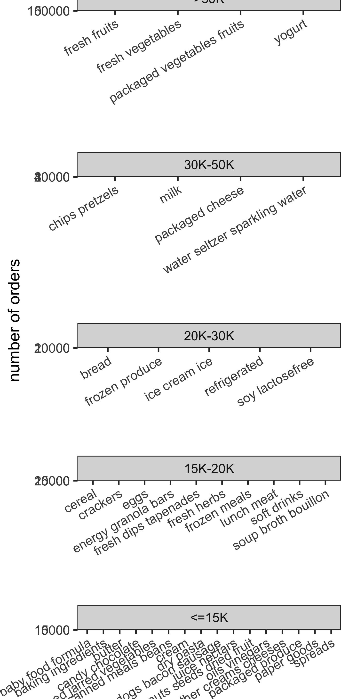
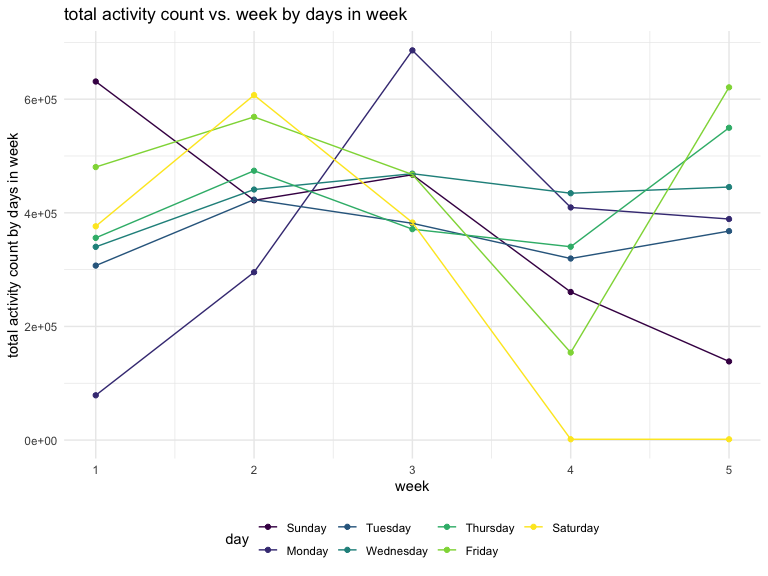
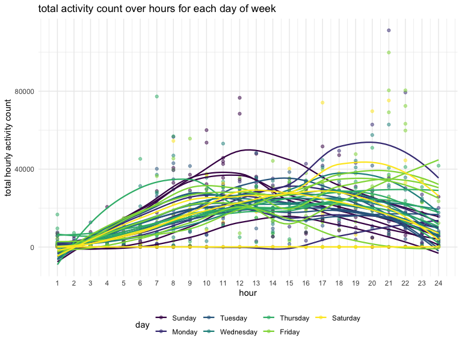
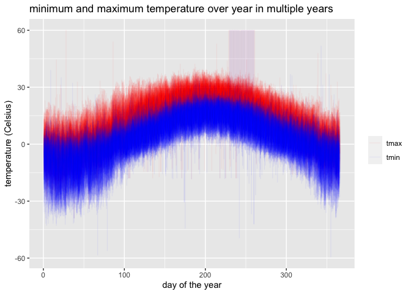
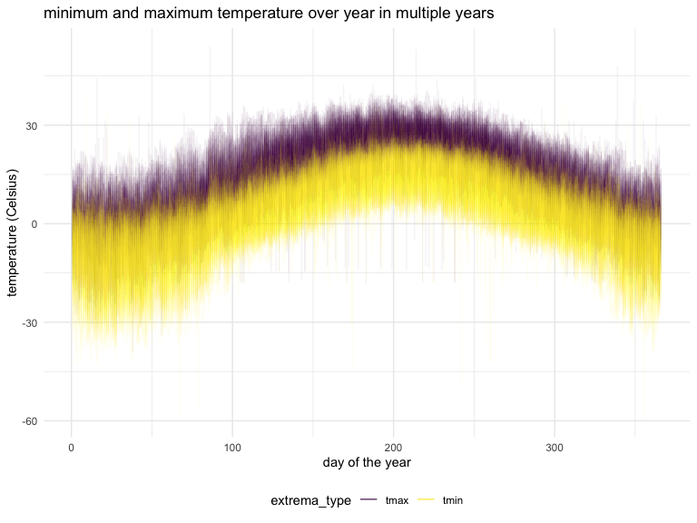
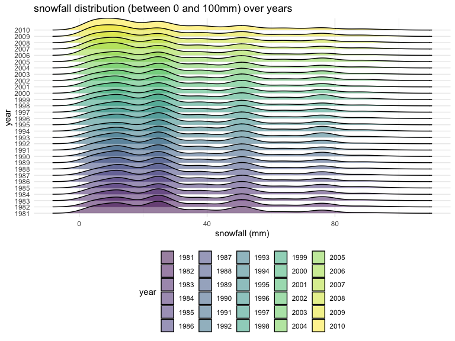
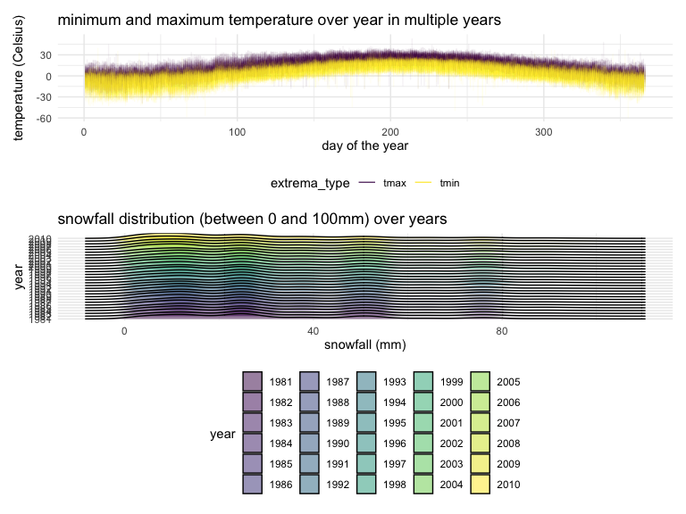

p8105_hw3_zw2899
================
Ziqing Wang
2022-10-10

# problem 1

First, immport the instacart dataset accoriding to the instructions:

``` r
library(p8105.datasets)
data("instacart")
```

The dataset has 1384617 observations and 15 variables. Each observation
contains information on one product ordered by the user.

There are 134 distinct aisles.

Below is a plot that shows the number of items ordered in aisles with
more than 10000 items ordered, arranged by descending items ordered
(from the provided solutions).

``` r
instacart %>% 
  count(aisle) %>% 
  filter(n > 10000) %>% 
  mutate(aisle = fct_reorder(aisle, n)) %>% 
  ggplot(aes(x = aisle, y = n)) + 
  geom_point() + 
  labs(title = "Number of items ordered in each aisle") +
  theme(axis.text.x = element_text(angle = 60, hjust = 1))
```



Below is a table showing the three most popular items in each of the
aisles “baking ingredients”, “dog food care”, and “packaged vegetables
fruits”, along with the number of times each item is ordered.

``` r
instacart %>%
  filter(aisle %in% c("baking ingredients", "dog food care", "packaged vegetables fruits")) %>%
  group_by(aisle, product_name) %>%
  summarize(n_ordered = n()) %>%
  arrange(aisle, desc(n_ordered)) %>%
  group_by(aisle) %>%
  slice(1:3) %>%
  rename(most_ordered_product = product_name) 
```

    ## `summarise()` has grouped output by 'aisle'. You can override using the
    ## `.groups` argument.

    ## # A tibble: 9 × 3
    ## # Groups:   aisle [3]
    ##   aisle                      most_ordered_product                        n_ord…¹
    ##   <chr>                      <chr>                                         <int>
    ## 1 baking ingredients         Light Brown Sugar                               499
    ## 2 baking ingredients         Pure Baking Soda                                387
    ## 3 baking ingredients         Cane Sugar                                      336
    ## 4 dog food care              Snack Sticks Chicken & Rice Recipe Dog Tre…      30
    ## 5 dog food care              Organix Chicken & Brown Rice Recipe              28
    ## 6 dog food care              Small Dog Biscuits                               26
    ## 7 packaged vegetables fruits Organic Baby Spinach                           9784
    ## 8 packaged vegetables fruits Organic Raspberries                            5546
    ## 9 packaged vegetables fruits Organic Blueberries                            4966
    ## # … with abbreviated variable name ¹​n_ordered

Below is a table showing the mean hour of the day at which Pink Lady
Apples and Coffee Ice Cream are ordered on each day of the week in a
readable format.

``` r
instacart %>%
  filter(product_name %in% c("Pink Lady Apples", "Coffee Ice Cream")) %>%
  mutate(new_dow = order_dow + 1) %>%
  mutate(day_of_week = wday(new_dow, label = T)) %>%
  group_by(product_name, day_of_week) %>%
  summarize(mean_hour_ordered = mean(order_hour_of_day)) %>%
  pivot_wider(names_from = day_of_week, values_from = mean_hour_ordered)
```

    ## `summarise()` has grouped output by 'product_name'. You can override using the
    ## `.groups` argument.

    ## # A tibble: 2 × 8
    ## # Groups:   product_name [2]
    ##   product_name       Sun   Mon   Tue   Wed   Thu   Fri   Sat
    ##   <chr>            <dbl> <dbl> <dbl> <dbl> <dbl> <dbl> <dbl>
    ## 1 Coffee Ice Cream  13.8  14.3  15.4  15.3  15.2  12.3  13.8
    ## 2 Pink Lady Apples  13.4  11.4  11.7  14.2  11.6  12.8  11.9

# problem 2

First, import and tidy the accelerometer data:

``` r
accel_data = read_csv("./data/accel_data.csv") %>%
  janitor::clean_names() %>%
  # convert the data to the longer format that is more suitable for manipulation using tidyverse
  pivot_longer(cols = "activity_1":"activity_1440", 
               names_to = "minute", 
               values_to = "activity_count") %>%
  # create a new variable indicataing whether the day is a weekday or a weekend
  mutate(if_weekend = case_when(day %in% c("Friday", "Thursday", "Wednesday", "Tuesday", "Monday") ~ "weekday",
                                TRUE ~ "weekend")) %>%
  # convert the activity_xx variable to a minute variable using separate()
  separate(minute, c("m1", "minute"), sep = "_") %>%
  select(-m1) %>% # remove the acticity prefix
  # convert the minute variable from character to numeric
  # create an hour variable indicating which hour of the day an observation is in
  mutate(minute = as.numeric(minute),
         hour = rep(rep(seq(1,24), each=60), 35)) %>%
  # convert the day variable to a factor with conventional level order
  mutate(day = factor(day, levels = c("Sunday", "Monday", "Tuesday", "Wednesday", "Thursday", "Friday", "Saturday")))
```

    ## Rows: 35 Columns: 1443
    ## ── Column specification ────────────────────────────────────────────────────────
    ## Delimiter: ","
    ## chr    (1): day
    ## dbl (1442): week, day_id, activity.1, activity.2, activity.3, activity.4, ac...
    ## 
    ## ℹ Use `spec()` to retrieve the full column specification for this data.
    ## ℹ Specify the column types or set `show_col_types = FALSE` to quiet this message.

``` r
accel_data
```

    ## # A tibble: 50,400 × 7
    ##     week day_id day    minute activity_count if_weekend  hour
    ##    <dbl>  <dbl> <fct>   <dbl>          <dbl> <chr>      <int>
    ##  1     1      1 Friday      1           88.4 weekday        1
    ##  2     1      1 Friday      2           82.2 weekday        1
    ##  3     1      1 Friday      3           64.4 weekday        1
    ##  4     1      1 Friday      4           70.0 weekday        1
    ##  5     1      1 Friday      5           75.0 weekday        1
    ##  6     1      1 Friday      6           66.3 weekday        1
    ##  7     1      1 Friday      7           53.8 weekday        1
    ##  8     1      1 Friday      8           47.8 weekday        1
    ##  9     1      1 Friday      9           55.5 weekday        1
    ## 10     1      1 Friday     10           43.0 weekday        1
    ## # … with 50,390 more rows

The tidied dataset contains 50400 observations and 7 variables. The
dataset contains minute-by-minute activity count of a person everyday
for for 5 weeks.

Next, aggregate across minutes to create a total activity variable for
each day:

``` r
total_activity_summary = accel_data %>%
  group_by(week, day) %>%
  summarize(total_activity = sum(activity_count)) 
```

    ## `summarise()` has grouped output by 'week'. You can override using the
    ## `.groups` argument.

``` r
total_activity_summary
```

    ## # A tibble: 35 × 3
    ## # Groups:   week [5]
    ##     week day       total_activity
    ##    <dbl> <fct>              <dbl>
    ##  1     1 Sunday           631105 
    ##  2     1 Monday            78828.
    ##  3     1 Tuesday          307094.
    ##  4     1 Wednesday        340115.
    ##  5     1 Thursday         355924.
    ##  6     1 Friday           480543.
    ##  7     1 Saturday         376254 
    ##  8     2 Sunday           422018 
    ##  9     2 Monday           295431 
    ## 10     2 Tuesday          423245 
    ## # … with 25 more rows

From the summary table above, I don’t see any apparent trend of activity
count by day. We make some plots to verify this:

``` r
total_activity_summary %>%
  ggplot(aes(x = week, y = total_activity, color = day, group = day)) +
  geom_point() +
  geom_line() + 
  labs(y = "total activity count by days in week", 
       title = "total activity count vs. week by days in week")
```


I don’t see any apparent trend either from the plot above.

Next, I aggregate the data by hour to make a single-panel plot that
shows the 24-hour activity time courses for each day and use color to
indicate day of the week.

``` r
# prepare a dataframe for plotting
hourly_accel_data = accel_data %>%
  group_by(week, day, hour) %>%
  summarize(total_activity_hourly = sum(activity_count)) 
```

    ## `summarise()` has grouped output by 'week', 'day'. You can override using the
    ## `.groups` argument.

``` r
hourly_accel_data
```

    ## # A tibble: 840 × 4
    ## # Groups:   week, day [35]
    ##     week day     hour total_activity_hourly
    ##    <dbl> <fct>  <int>                 <dbl>
    ##  1     1 Sunday     1                  1084
    ##  2     1 Sunday     2                   614
    ##  3     1 Sunday     3                  7766
    ##  4     1 Sunday     4                 20625
    ##  5     1 Sunday     5                 11380
    ##  6     1 Sunday     6                  1057
    ##  7     1 Sunday     7                   290
    ##  8     1 Sunday     8                 16756
    ##  9     1 Sunday     9                 37128
    ## 10     1 Sunday    10                 60013
    ## # … with 830 more rows

``` r
hourly_accel_data %>% ggplot(aes(x = hour, y = total_activity_hourly, 
                                 group = interaction(week, day), color = day)) + 
  geom_point(alpha = 0.5) +
  xlim(1,24) +
  geom_smooth(se = F, size = 0.8, alpha = 0.8) +
  labs(title = "total activity count over hours for each day of week",
       y = "total hourly activity count") +
  scale_x_continuous(breaks = seq(1, 24, by = 1))
```

    ## Scale for 'x' is already present. Adding another scale for 'x', which will
    ## replace the existing scale.

    ## `geom_smooth()` using method = 'loess' and formula 'y ~ x'


I overlayed lines fitted by geom_smooth() over the data points for more
informative and aesthetic visualization than line plots. The plot shows
that overall, the person’s activity level increases from midnight to
about 10am everyday. The activity mostly peaks aroound 7pm/8pm.

# problem 3

First, load the NY NOAA data

``` r
data("ny_noaa")
```

The imported NOAA dataset has 2595176 observations and 7 columns. The
dataset contains information reported from weather stations in the state
of New York on dates from January 1, 1981 through December 31, 2010 -
including the precipitation (tenth of mm), snowfall (mm), snow depth
(mm), maximum daily temperature, and minimum daily temperature (both in
tenth of Celsius). Note that there are many missing data in this
dataset:

``` r
total_obs_noaa = nrow(ny_noaa)
ny_noaa %>%
  summarise_all(funs(sum(is.na(.)))) %>%
  pivot_longer(id:tmin, names_to = "variable", values_to = "percent_missing") %>%
  mutate(percent_missing = percent_missing/total_obs_noaa*100)
```

    ## # A tibble: 7 × 2
    ##   variable percent_missing
    ##   <chr>              <dbl>
    ## 1 id                  0   
    ## 2 date                0   
    ## 3 prcp                5.62
    ## 4 snow               14.7 
    ## 5 snwd               22.8 
    ## 6 tmax               43.7 
    ## 7 tmin               43.7

We can see that precipitation, snowfall, and small depth has relatively
small number of missing values. However, almost half of the minimum and
maximum temperature data are missing in this dataset, which might lead
to bias in analyses.

We clean the data by converting the unit of tmax and tmin from tenth of
Celsius to Celsius. We also convert the unit of precipitation from tenth
of mm to mm. We also separate the date variable to year, month, and day
variables. We choose to not change the unit of the snowfall variable
because mm is already a widely-used unit worldwide.

``` r
cleaned_ny_noaa = ny_noaa %>%
  mutate(date_full = date) %>%
  separate(date, c("year", "month", "day"), sep = "-") %>%
  mutate(tmax = as.numeric(tmax)/10,
         tmin = as.numeric(tmin)/10,
         prcp = prcp/10) # convert tenths of values to to actual values

cleaned_ny_noaa
```

    ## # A tibble: 2,595,176 × 10
    ##    id          year  month day    prcp  snow  snwd  tmax  tmin date_full 
    ##    <chr>       <chr> <chr> <chr> <dbl> <int> <int> <dbl> <dbl> <date>    
    ##  1 US1NYAB0001 2007  11    01       NA    NA    NA    NA    NA 2007-11-01
    ##  2 US1NYAB0001 2007  11    02       NA    NA    NA    NA    NA 2007-11-02
    ##  3 US1NYAB0001 2007  11    03       NA    NA    NA    NA    NA 2007-11-03
    ##  4 US1NYAB0001 2007  11    04       NA    NA    NA    NA    NA 2007-11-04
    ##  5 US1NYAB0001 2007  11    05       NA    NA    NA    NA    NA 2007-11-05
    ##  6 US1NYAB0001 2007  11    06       NA    NA    NA    NA    NA 2007-11-06
    ##  7 US1NYAB0001 2007  11    07       NA    NA    NA    NA    NA 2007-11-07
    ##  8 US1NYAB0001 2007  11    08       NA    NA    NA    NA    NA 2007-11-08
    ##  9 US1NYAB0001 2007  11    09       NA    NA    NA    NA    NA 2007-11-09
    ## 10 US1NYAB0001 2007  11    10       NA    NA    NA    NA    NA 2007-11-10
    ## # … with 2,595,166 more rows

We go through some extra steps to convert the year, month, and day
variables to number, character, and number format:

``` r
cleaned_ny_noaa = cleaned_ny_noaa %>%
  mutate(year = as.integer(year),
         month = month.name[as.integer(month)],
         day = as.integer(day))
cleaned_ny_noaa
```

    ## # A tibble: 2,595,176 × 10
    ##    id           year month      day  prcp  snow  snwd  tmax  tmin date_full 
    ##    <chr>       <int> <chr>    <int> <dbl> <int> <int> <dbl> <dbl> <date>    
    ##  1 US1NYAB0001  2007 November     1    NA    NA    NA    NA    NA 2007-11-01
    ##  2 US1NYAB0001  2007 November     2    NA    NA    NA    NA    NA 2007-11-02
    ##  3 US1NYAB0001  2007 November     3    NA    NA    NA    NA    NA 2007-11-03
    ##  4 US1NYAB0001  2007 November     4    NA    NA    NA    NA    NA 2007-11-04
    ##  5 US1NYAB0001  2007 November     5    NA    NA    NA    NA    NA 2007-11-05
    ##  6 US1NYAB0001  2007 November     6    NA    NA    NA    NA    NA 2007-11-06
    ##  7 US1NYAB0001  2007 November     7    NA    NA    NA    NA    NA 2007-11-07
    ##  8 US1NYAB0001  2007 November     8    NA    NA    NA    NA    NA 2007-11-08
    ##  9 US1NYAB0001  2007 November     9    NA    NA    NA    NA    NA 2007-11-09
    ## 10 US1NYAB0001  2007 November    10    NA    NA    NA    NA    NA 2007-11-10
    ## # … with 2,595,166 more rows

The most commonly observed values in snowfall is calculated as follows:

``` r
cleaned_ny_noaa %>%
  group_by(snow) %>%
  summarize(snowfall_mm_count = n()) %>%
  arrange(desc(snowfall_mm_count))
```

    ## # A tibble: 282 × 2
    ##     snow snowfall_mm_count
    ##    <int>             <int>
    ##  1     0           2008508
    ##  2    NA            381221
    ##  3    25             31022
    ##  4    13             23095
    ##  5    51             18274
    ##  6    76             10173
    ##  7     8              9962
    ##  8     5              9748
    ##  9    38              9197
    ## 10     3              8790
    ## # … with 272 more rows

We can see from above that the most common values for snowfall is 0.
This is probably because for most of the places in New York, it doesn’t
snow most time in the year.

Below is a plot showing the average maximum temperature in January and
July in each weather station across years:

``` r
cleaned_ny_noaa %>%
  filter(month %in% c("January", "July")) %>%
  group_by(id, year, month) %>%
  summarize(mean_tmax = mean(tmax, na.rm = T)) %>%
  filter(!is.na(mean_tmax)) %>%
  ggplot(aes(x = year, y = mean_tmax, col = month, group = id)) +
  geom_line(alpha = 0.3) +
  facet_grid(.~ month) + 
  theme(legend.position = "none") +
  labs(title = "average maximum temperature in January vs. July for each weather station",
       y = "average maximum temperature (Celsius)")
```

    ## `summarise()` has grouped output by 'id', 'year'. You can override using the
    ## `.groups` argument.


Based on the above 2-panel plot, it seems like the average maximum
temperature in January and July in stations across years vary together
in the same direction, i.e., higher maximum temperature in January
corresponds to higher maximum temperature in July as well.

One outlier is that, around 1987, the average maximum temperature in
July of one station (\~15 Celsius) was much lower than that for other
stations (\~30 Celsius).

Another outlier us that, around 1982, the average maximum temperature in
January of one station (\< -10 Celsius) was much lower than that for
other stations (mostly between 0 Celsius and -19 Celsius).

Another outlier was that, around 2004, the average maximum temperature
in January of one station (\~10 Celsius) was much higher than that for
other stations (mostly between 0 Celsius and -10 Celsius).

Below is a plot showing tmax vs tmin for the full dataset. Alternative
to a scatterplot, we plot tmin and tmax from different years against
days of the year and observe how one changes with the other:

``` r
tmax_tmin_full_data = cleaned_ny_noaa %>%
  filter(!is.na(tmin) & !is.na(tmax)) %>%
  filter(tmin < 50 & tmax < 60) %>% # filter out unreasonable temperature extremes
  mutate(day_365 = yday(date_full)) %>%
  pivot_longer(cols = tmax:tmin, names_to = "extrema_type", values_to = "temp") %>%
  ggplot() +
  geom_line(aes(x = day_365, y = temp, color = extrema_type, group = interaction(year, extrema_type)),
            alpha = 0.05) +
  #scale_color_manual(name = "", values = c("red", "blue"), labels = c("tmax", "tmin")) +
  guides(colour = guide_legend(override.aes = list(alpha = 0.8)),
         fill=guide_legend(title="extrema type")) +
  labs(title = "minimum and maximum temperature over year in multiple years",
       x = "day of the year", y = "temperature (Celsius)") 
  #theme(legend.position = "bottom")
  #facet_grid(. ~ tmax_or_tmin) +
  #theme(legend.position = "none")
  #geom_smooth(se = F) 

tmax_tmin_full_data
```


We can see that in general, the maximum temperature and the minimum
temperature vary together in the same direction.

Below is a plot of the distribution of snowfall values greater than 0
and less than 100 separately by year.

``` r
snowfall_dist = cleaned_ny_noaa %>%
  mutate(year = factor(year)) %>%
  filter(snow > 0 & snow < 100) %>%
  ggplot(aes(x = snow, y = year, fill = year)) +
  geom_density_ridges(alpha = 0.5, scale = 2)  +
  labs(title = "snowfall distribution (between 0 and 100mm) over years",
       x = "snowfall (mm)", y = "year") 

snowfall_dist
```

    ## Picking joint bandwidth of 3.76


From the plot above, we can see that the distributions of snowfall
values greater than 0 and less than 100 are pretty similar every year.

Use the Patchwork package to make a two-panel plot from the two previous
plots:

``` r
tmax_tmin_full_data / snowfall_dist 
```

    ## Picking joint bandwidth of 3.76


